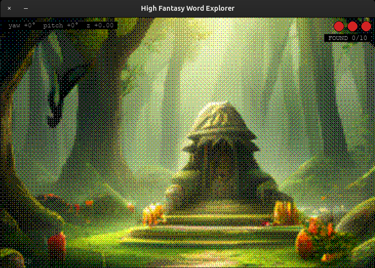
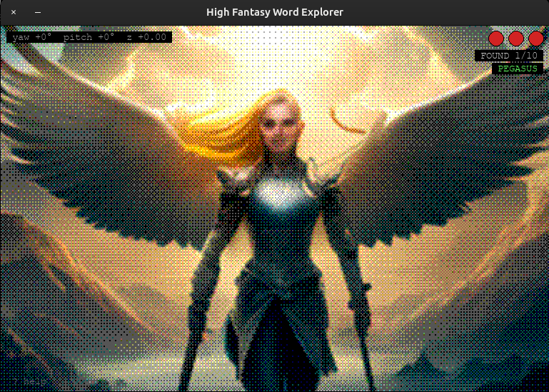
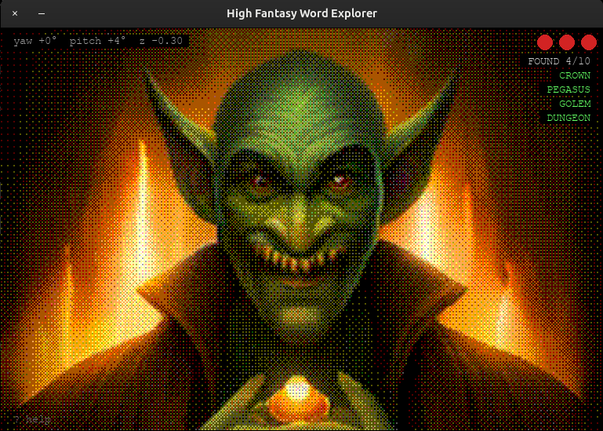

# High Fantasy Word Explorer

A retro pixel-art word-guessing game powered by AI image generation.

Explore AI-generated high-fantasy scenes using novel-view synthesis, and guess
the hidden word each scene depicts. Find 10 words to win.

## Demo


## Screenshots

| | | |
|---|---|---|
|  |  |  |
| *Start of a new game* | *First word found* | *Deep into a run* |

## How to play

- Scenes are generated by **MIRO** and rendered with a retro Bayer-dithered
  pixel aesthetic.
- Navigate with the camera to explore the scene from different angles, powered
  by **OVIE** novel-view synthesis.
- Press **Tab** to open the input field, type your guess, press **Enter**.
- A correct guess advances to the next scene. A wrong guess costs a life.
- 3 lives total. Find 10 words to win. Press **Enter** after game-over to
  replay with a shuffled word set.

## Controls

| Key | Action |
|-----|--------|
| Z | Move forward |
| S | Move backward |
| ← → | Yaw (turn left / right) |
| ↑ ↓ | Pitch (look up / down) |
| R | Reset camera to origin |
| Tab | Open / close input field |
| Enter | Submit guess (or restart after game-over) |
| Backspace | Delete last character |
| ? | Toggle help overlay |
| ESC / Q | Close overlay / quit |

## Requirements

- Linux, NVIDIA GPU with CUDA
- Python 3.12 with a PyTorch venv (see `install.sh`)
- The [OVIE](https://github.com/kyutai-labs/ovie) repository cloned locally

## Setup

```bash
# Clone OVIE alongside this repo (or set OVIE_PATH)
git clone https://github.com/kyutai-labs/ovie ../ovie

# Run the install script (once)
./install.sh

# Launch the game
./run.sh
```

`OVIE_PATH` defaults to `../ovie` relative to `game.py`. Override if needed:

```bash
OVIE_PATH=/path/to/ovie ./run.sh
```

## Optional arguments

```
--seed INT      Random seed (default: 3407)
--steps INT     MIRO inference steps (default: 40; lower = faster)
--guidance FLOAT  Guidance scale (default: 7.0)
```

Example:

```bash
./run.sh --steps 50
```

## Model weights

Both models are downloaded automatically from Hugging Face on first run:

- **MIRO**: `nicolas-dufour/miro`
- **OVIE**: `kyutai/ovie` (revision `v1.0`)

Weights are cached in `~/.cache/huggingface/`.
